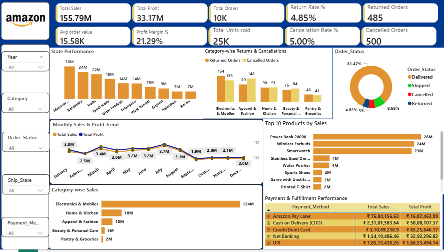

# Amazon India Sales Dashboard

A Power BI dashboard project created to analyze Amazon India sales data and provide a clear overview of business performance through interactive KPIs, charts, and filters.

## Dashboard Preview

## Project Overview

This project focuses on analyzing sales and business performance using Microsoft Power BI. The dashboard presents important information related to sales, profit, orders, products, categories, order status, payment methods, fulfillment, and geographic performance in a simple and easy-to-understand format.

## Objectives

- Monitor overall sales and profit performance
- Analyze monthly sales and profit trends
- Identify top-performing products and categories
- Understand order status, returns, and cancellations
- Compare payment and fulfillment performance
- Analyze state-wise business performance
- Support data-driven business decisions

## Key KPIs

- Total Sales
- Total Profit
- Total Orders
- Total Units Sold
- Average Order Value
- Profit Margin %
- Return Rate %
- Cancellation Rate %

## Dashboard Visuals

- Monthly Sales & Profit Trend
- State Performance
- Order Status
- Top 10 Products by Sales
- Category-wise Sales
- Category-wise Profit
- Category-wise Units Sold
- Category-wise Returns & Cancellations
- Payment & Fulfillment Performance

## Interactive Filters

The dashboard includes slicers for:

- Year
- Category
- Order Status
- Ship State
- Payment Method

These filters allow users to explore the data from different business perspectives.

## Tools Used

- Microsoft Power BI
- DAX
- Microsoft Excel

## Dataset

The project uses the Amazon India sales dataset provided for the analysis.

## Key Insights

The dashboard helps users understand overall business performance, identify high-performing products and categories, monitor order outcomes, compare payment and fulfillment methods, and evaluate geographic performance.

## Conclusion

The Amazon India Sales Dashboard provides an interactive and easy-to-understand view of business performance. It demonstrates the use of Power BI and DAX to transform sales data into meaningful business insights and support better decision-making.
